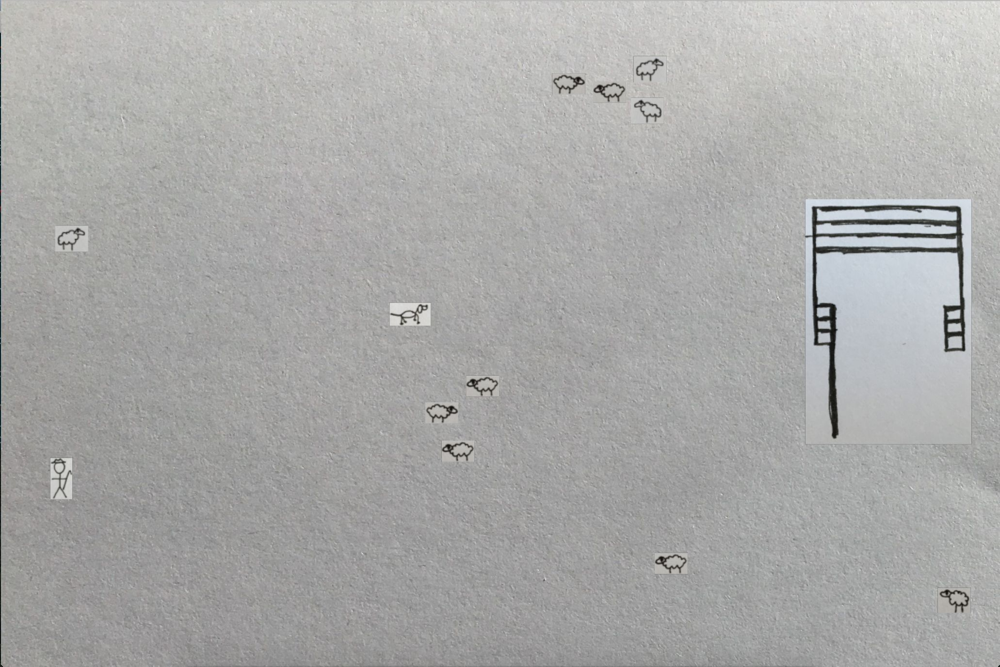

# Sheeps

A Sheep herding game made at Rails Camp Scotland 2016




## Setup

1. Install Gosu

2. Run

```
ruby game.rb
```

## Real life sheep herding commands

Basic herding dog commands

Find - search for the stock

Come-bye - go to the left of the stock, or clockwise around them.

Away to me - go to the right of the stock or counter clockwise around them.

That'll do - stop working and return to the handler.

Stand - stop, although when said gently may also mean just to slow down

Steady - slow down

Get out or back - move away from the stock. Use when the dog

Speak up - bark at the stock. Useful when more force is needed.
