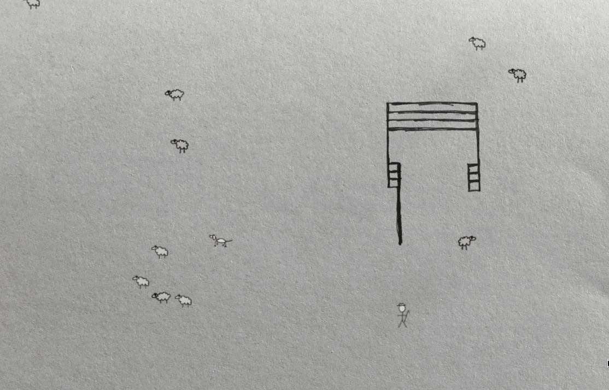

# Sheeps

A sheep herding game made in a day at [Rails Camp Scotland 2016](http://scotland.railscamp.eu/).



I spent the day before [Rails Camp Scotland 2016](http://scotland.railscamp.eu/) exploring the country side of Scotland; one word: Sheep. That night I flicked on the TV. It was sheep herding. I was inspired and decided to try making a game based on the real deal.

## Setup

Install [prerequisites for gosu](https://github.com/gosu/gosu/wiki)
e.g.,
```
brew install sdl2
```

Install gems
```
bundle install
```

Launch the game
```
ruby game.rb
```

## Controls

Based on real life sheep herding commands

* w Find - search for the stock
* a Come-bye - go to the left of the stock, or clockwise around them
* s Away to me - go to the right of the stock or counter clockwise around them.
* d That'll do - stop working and return to the handler.

* arrow keys - walk

* space - close/open the gate

## Contribution

Pull requests welcome. Here's some ideas.
* Stop sheep running through fence
* Remove farmers telepathic gate opening/closing powers
* Add sound effects (farmer commands, sheep and dog noises)
* Clean up graphics
* Add a splash screen to start and restart the game
* Prevent pen from appearing off the edge of the screen sometimes
* Refactoring
* Add ability to control via voice commands (hint: pocketsphinx gem)


## Other real life sheep herding commands

Taken from wikipedia. These haven't been implemented yet.

Stand - stop, although when said gently may also mean just to slow down

Steady - slow down

Get out or back - move away from the stock. Use when the dog

Speak up - bark at the stock. Useful when more force is needed.
